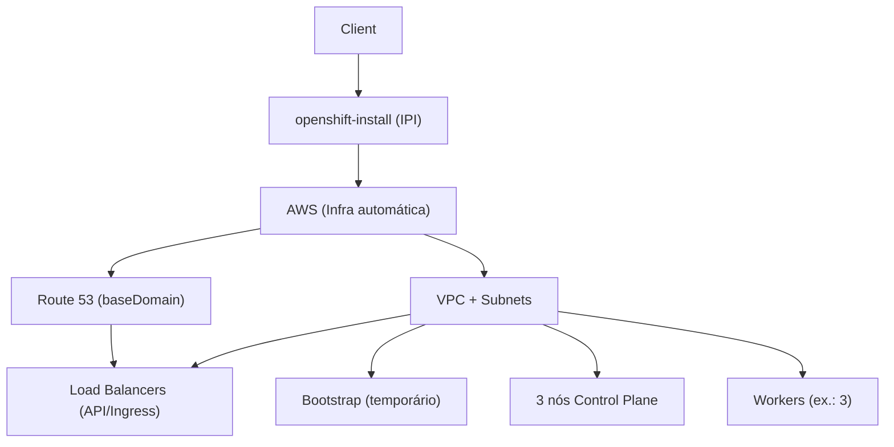

# INSTALL_OKD_AWSIPI.md

## O que é AWS IPI (Installer‑Provisioned Infrastructure)
No modo **IPI**, o **instalador do OpenShift** cria automaticamente toda a infraestrutura na **AWS** (VPC, sub‑redes, NAT, balanceadores, Route 53, IAM, EC2, S3). É o caminho mais simples para começar, pois você informa poucas configurações e o instalador faz o resto.

---

## Pré‑requisitos
- **Conta AWS** com permissão para criar EC2, IAM, VPC, ELB, S3 e Route 53.
- **Domínio** com **Hosted Zone pública no Route 53** (ex.: `minhaempresa.com`) para servir de **baseDomain**.
- **Pull Secret da Red Hat** (baixe no OpenShift Cluster Manager).
- **Ubuntu 24.04** com `awscli`, `openshift-install` e `oc` instalados.

---

## Passo a passo
### 1) Preparar o Ubuntu
```bash
sudo apt update && sudo apt install -y unzip curl jq

# AWS CLI v2
curl -Ls https://awscli.amazonaws.com/awscli-exe-linux-x86_64.zip -o awscliv2.zip
unzip -q awscliv2.zip && sudo ./aws/install

# Ferramentas OpenShift
cd ~/Downloads
curl -LO https://mirror.openshift.com/pub/openshift-v4/clients/ocp/latest/openshift-install-linux.tar.gz
curl -LO https://mirror.openshift.com/pub/openshift-v4/clients/ocp/latest/openshift-client-linux.tar.gz
tar -xzf openshift-install-linux.tar.gz
tar -xzf openshift-client-linux.tar.gz
sudo mv openshift-install oc kubectl /usr/local/bin/
```

### 2) Route 53
Garanta uma **Hosted Zone pública** do seu domínio (ex.: `minhaempresa.com`). Ela será usada como **baseDomain** do cluster.

### 3) Pull Secret
Baixe a **pull secret** (JSON) no **OpenShift Cluster Manager** e guarde para colar no `install-config.yaml`.

### 4) Credenciais AWS
```bash
aws configure
# Informe Access Key, Secret, região (ex.: us-east-1) e output (json)
```

### 5) Gerar e revisar a configuração
```bash
mkdir -p ~/ocp-aws-ipi && cd ~/ocp-aws-ipi
openshift-install create install-config --dir .
# Responda: baseDomain, nome do cluster, região AWS, cole a Pull Secret e (opcional) sua chave SSH pública.
```
O arquivo `install-config.yaml` será criado. Você pode substituí-lo pelo **modelo completo** abaixo (ajuste os campos marcados).

### 6) Criar o cluster
```bash
openshift-install create cluster --dir .
```
O instalador vai **provisionar tudo automaticamente** na AWS. Aguarde a finalização.

### 7) Acessar o cluster
Ao final, o instalador mostra:
- **Console Web** (ex.: `https://console-openshift-console.apps.<cluster>.<baseDomain>`)
- **Usuário `kubeadmin` e senha** (ficam em `auth/`)

Use o CLI:
```bash
export KUBECONFIG=$PWD/auth/kubeconfig
oc whoami
oc get nodes
```

### 8) Destruir (para evitar custos quando terminar)
```bash
openshift-install destroy cluster --dir .
```

---

## Arquitetura


---

## Modelo **completo** de `install-config.yaml`
> **Atenção:** Edite os campos entre `<>` antes de usar.

```yaml
apiVersion: v1
baseDomain: <SEU_DOMINIO_NO_ROUTE53>            # Ex.: minhaempresa.com
metadata:
  name: <NOME_DO_CLUSTER>                       # Ex.: meucluster
platform:
  aws:
    region: <AWS_REGION>                        # Ex.: us-east-1
    # Opcional: para ambientes com política de menor privilégio (IAM pré-criado):
    # hostedZone: <ID_DA_HOSTED_ZONE>
    # userTags: { Projeto: "OCP", Ambiente: "Prod" }
publish: External                                # Expõe rotas/public endpoints externamente
controlPlane:
  name: master
  replicas: 3
  platform:
    aws:
      type: m6i.xlarge                          # Tamanho das instâncias de control-plane
      rootVolume:
        size: 300                               # GB
        type: gp3
  hyperthreading: Enabled
compute:
- name: worker
  replicas: 3
  platform:
    aws:
      type: m6i.xlarge                          # Tamanho das instâncias de worker
      rootVolume:
        size: 300
        type: gp3
networking:
  networkType: OVNKubernetes
  clusterNetwork:
  - cidr: 10.128.0.0/14
    hostPrefix: 23
  serviceNetwork:
  - 172.30.0.0/16
  machineNetwork:
  - cidr: 10.0.0.0/16                           # VPC criada automaticamente
# Segurança e conformidade
fips: false                                      # true se você precisar de FIPS
# Credenciais
pullSecret: '<COLE_AQUI_O_JSON_DA_PULL_SECRET>'  # JSON completo em uma linha
sshKey: 'ssh-ed25519 AAAA...seu_ssh_publico...'  # Opcional, mas recomendado
# Parâmetros opcionais úteis
# additionalTrustBundle: |
#   -----BEGIN CERTIFICATE-----
#   ...
#   -----END CERTIFICATE-----
# imageContentSources:
# - mirrors:
#   - mirror.registry.local:5000/ocp/release
#   source: quay.io/openshift-release-dev/ocp-release
```

---

## Dicas finais
- **IPI** é ideal para começar (menos passos manuais). Para ambientes com controles rígidos de rede/IAM, avalie **UPI** no futuro.
- Prefira **regiões com 3+ AZs** para alta disponibilidade.
- Salve com cuidado os arquivos em `auth/` (contém `kubeconfig` e senha do `kubeadmin`).

---

## Comandos úteis
```bash
# Ver eventos da instalação
openshift-install wait-for install-complete --dir .

# Exportar KUBECONFIG sempre que abrir nova sessão
export KUBECONFIG=$PWD/auth/kubeconfig

# Verificar nós e operadores
oc get nodes -o wide
oc get co
```
